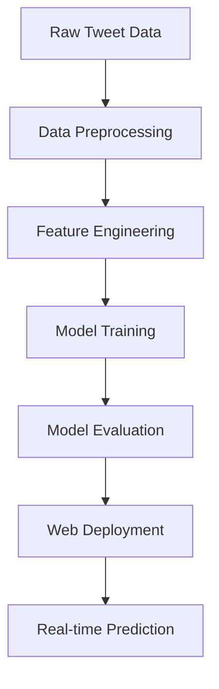

# 🌪️ Disaster Tweet Classification Project


## 📋 Project Overview

This project aims to classify tweets as either related to real disasters or not using Natural Language Processing (NLP) and Machine Learning techniques. The model helps organizations like disaster relief agencies and news outlets monitor Twitter for real-time disaster alerts.



## 🎯 Key Features

- 🔍 **Text Preprocessing**: Cleaning, tokenization, and normalization of tweet text
- 📊 **Comprehensive EDA**: 15+ visualizations to understand data patterns
- 🤖 **Multiple ML Models**: Comparison of various classification algorithms
- ⚙️ **Hyperparameter Tuning**: Optimized model performance
- 🌐 **Web Interface**: Flask-based application for real-time predictions
- 📈 **Performance Metrics**: Detailed evaluation with confusion matrices, ROC curves, and more


## 🛠️ Installation & Setup

1. **Clone the repository**
   ```bash
   git clone https://github.com/tayade-aniket/twitter_disaster_classification.git
   cd twitter_disaster_classification
   ```

2. **Create a virtual environment**
   ```bash
   python -m venv venv
   source venv/bin/activate  # On Windows: venv\Scripts\activate
   ```

3. **Install dependencies**
   ```bash
   pip install -r requirements.txt
   ```

4. **Download NLTK resources**
   ```python
   import nltk
   nltk.download('punkt')
   nltk.download('stopwords')
   nltk.download('wordnet')
   ```

## 🚀 Usage

### Training the Model
```bash
python disaster_tweet_model.py
```

### Running the Web Application
```bash
python app.py
```

Then open your browser and navigate to `http://localhost:5000`

### Making Predictions
1. Enter tweet text in the web interface
2. Click "Classify Tweet"
3. View the prediction (Disaster/Non-Disaster) with confidence score

## 📊 Dataset Information

The dataset contains 10,000 hand-classified tweets with the following columns:

- **id**: Unique identifier for each tweet
- **keyword**: Specific keyword from the tweet (may be empty)
- **location**: Location from where the tweet was sent (may be empty)
- **text**: The actual tweet text
- **target**: Denotes whether a tweet is about a real disaster (1) or not (0)

## 🔧 Technical Approach

### 1. Data Preprocessing
- Text cleaning (URLs, mentions, punctuation removal)
- Tokenization and stopword removal
- Stemming and lemmatization
- TF-IDF and Count vectorization

### 2. Model Selection
- ✅ Logistic Regression
- ✅ Multinomial Naive Bayes
- ✅ Random Forest Classifier
- ✅ Support Vector Machine

### 3. Evaluation Metrics
- Accuracy, Precision, Recall, F1-Score
- Confusion Matrix
- ROC Curve and AUC Score
- Precision-Recall Curve

## 📈 Results

|        Model        | Accuracy | Precision | Recall | F1-Score |
|---------------------|----------|-----------|--------|----------|
| Logistic Regression | 0.82     | 0.81      | 0.79   | 0.80     |
| Random Forest       | 0.79     | 0.77      | 0.76   | 0.76     |
| SVM                 | 0.80     | 0.79      | 0.77   | 0.78     |
| Naive Bayes         | 0.76     | 0.74      | 0.75   | 0.74     |

## 🌐 Web Interface

The application features a clean, user-friendly interface:

- **Input Field**: For entering tweet text
- **Real-time Classification**: Instant disaster/non-disaster prediction
- **Confidence Score**: Probability measurement of the prediction
- **Visual Feedback**: Color-coded results for easy interpretation

## 🤝 Contributing

We welcome contributions! Please feel free to submit a Pull Request. For major changes, please open an issue first to discuss what you would like to change.

1. Fork the project
2. Create your feature branch (`git checkout -b feature/AmazingFeature`)
3. Commit your changes (`git commit -m 'Add some AmazingFeature'`)
4. Push to the branch (`git push origin feature/AmazingFeature`)
5. Open a Pull Request

## 📝 License

This project is licensed under the MIT License - see the [LICENSE.md](LICENSE.md) file for details.

## 🙏 Acknowledgments

- Thanks to the providers of the disaster tweet dataset
- Inspiration from various NLP and machine learning resources
- Contributors and testers who helped improve the project

## 📞 Contact

For questions or suggestions, please contact:

Mr. Aniket Tayade - [tayadeanni@gmail.com]

Project Link: [https://github.com/tayade-aniket/twitter_disaster_classification](https://github.com/tayade-aniket/twitter_disaster_classification)

---

<div align="center">

⭐ **Don't forget to star this repository if you found it helpful!**

</div>